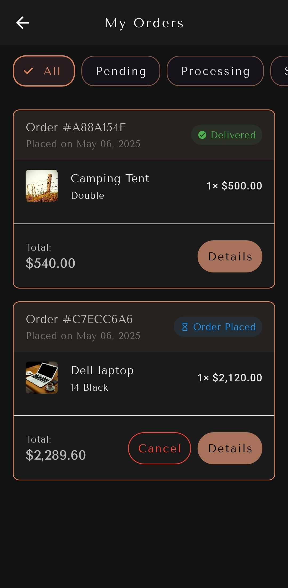

# eCommerce Mobile Application

A Flutter-based eCommerce mobile application that uses GetX for state management and navigation, along with Firebase and Cloud Firestore for backend services. The app provides a seamless shopping experience with features such as user authentication, product browsing, cart management, and order processing.

## Features

- **User Authentication**: Sign up, sign in, and sign out functionalities using Firebase Authentication.
- **Product Listing**: Browse products in a grid view with detailed information available for each product.
- **Shopping Cart**: Add, remove, and update items in the shopping cart.
- **Order Management**: Place orders, view order history, filter orders by status, and cancel orders.
- **Responsive UI**: Adaptive layouts using Flutter's responsive design principles.
- **State Management**: Utilizes GetX for efficient state management and routing.
- **Real-time Updates**: Live product and order updates through Firebase Firestore.
- **Offline Support**: Basic data persistence for viewing products offline.
- **Modular Code Structure**: Organized folder structure for easy maintenance and scalability.
- **Localization**: Full support for English and Arabic languages.
- **RTL/LTR Layout**: Automatic handling of right-to-left and left-to-right layouts based on language.
- **Theme Options**: Customizable light and dark themes with seamless switching capability.

## Technology Stack

- **Frontend**: Flutter (Dart)
- **State Management**: GetX
- **Backend**: Firebase
  - Authentication
  - Cloud Firestore
- **Local Storage**: Hive for client-side data persistence
- **UI Components**: Custom widgets and Material Design

## Folder Structure

```
ecommerce_app 
├── lib 
│ ├── main.dart # Application entry point 
│ ├── app 
│ │ ├── bindings # GetX dependency injection 
│ │ ├── components # Reusable UI components 
│ │ │ ├── notifications # Toast and notification widgets 
│ │ ├── data 
│ │ │ ├── models # Data models (Order, Product, etc.) 
│ │ │ ├── services # Firebase services (Auth, Firestore) 
│ │ ├── modules # Feature modules 
│ │ │ ├── orders # Order history and management 
│ │ │ │ ├── controllers # Order business logic 
│ │ │ │ ├── views # Order UI screens 
│ │ │ │ └── bindings # Order dependencies 
│ │ │ ├── cart # Shopping cart functionality 
│ │ │ ├── home # Home screen and product listings 
│ │ │ ├── auth # Authentication screens 
│ │ │ └── product_details # Detailed product view │ 
│ ├── routes # Application navigation routes 
│ │ └── ui # UI elements and themes 
├── android # Android-specific configuration 
├── assets # Images, icons and other assets 
├── pubspec.yaml # Project dependencies 
└── README.md
```

## Setup Instructions

1. **Clone the Repository**:
   ```
   git clone <repository-url>
   cd ecommerce_app
   ```

2. **Install Dependencies**: 
   Run the following command to install the required packages:
   ```
   flutter pub get
   ```

3. **Firebase Setup**:
   - Create a Firebase project in the Firebase Console.
   - Add your Android and iOS apps to the Firebase project.
   - Download the `google-services.json` and `GoogleService-Info.plist` files and place them in the respective directories.

4. **Run the Application**: 
   Use the following command to run the app on your device or emulator:
   ```
   flutter run
   ```

## Key Implementation Details

### Authentication
The app uses Firebase Authentication for user management with a custom `AuthService` that handles sign-up, sign-in, and sign-out operations.

### State Management
GetX is used for state management, providing:
- Reactive state updates with `.obs` variables
- Dependency injection through `Get.put()` and `Get.find()`
- Navigation with named routes via `Get.toNamed()`

### Orders Management
The app includes a comprehensive order management system that:
- Allows users to place orders from their cart
- Provides order history with filtering by status (all, pending, delivered, cancelled)
- Enables order cancellation with real-time updates
- Uses Firestore for persistent storage and real-time synchronization

### Data Models
Custom data models with Firebase integration:
- `OrderModel`: Tracks order details, status, and items
- `ProductModel`: Contains product information, pricing, and availability
- `UserModel`: Stores user profile information and preferences

## Screenshots

### Product Browsing & Details
<div align="center">
  
  
  
</div>

<br>

### Shopping & Order Management
<div align="center">
  
  
  
</div>

<br>

<div align="center">
  
  
  
</div>

<br>

### Localization
<div align="center">
  
  
</div>

<br>

### Account
<div align="center">
  
  
  
</div>

## Contributing

Contributions are welcome! Please feel free to submit a pull request or open an issue for any suggestions or improvements.

## License

This project is licensed under the MIT License. See the LICENSE file for more details.